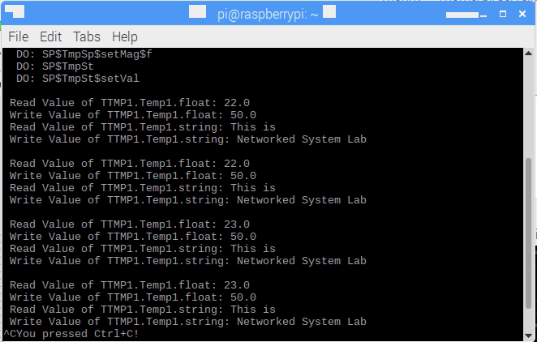
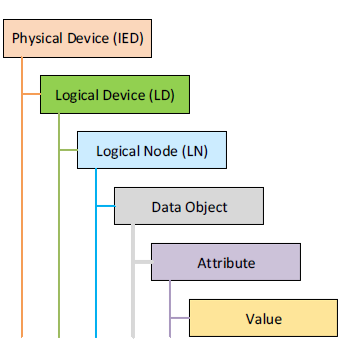

# pyiec61850
Server and Client of PyIEC61850 based on mz-automation

# A.	Requirements
1.	Python 2.7 or higher
2.	CMake 3.7.2 or higher
wget https://cmake.org/files/v3.7/cmake-3.7.2.tar.gz
tar zxvf cmake-3.7.2.tar.gz
cd cmake-3.7.2
./bootstrap && make
sudo make install
3.	SWIG 4.0.0 or higher
wget http://prdownloads.sourceforge.net/swig/swig-4.0.0.tar.gz
tar xzf swig-4.0.0.tar.gz
cd swig-4.0.0
./configure
make
sudo make install
# B.	Installation
1.	cd ~
2.	sudo apt update && upgrade
3.	git clone https://github.com/keyvdir/pyiec61850.git
4.	cd pyiec61850
5.	git clone https://github.com/mz-automation/libiec61850.git
6.	wget https://tls.mbed.org/download/mbedtls-2.6.0-apache.tgz
7.	tar zxvf mbedtls-2.6.0-apache.tgz
8.	mv mbedtls-2.6.0 libiec61850/third_party/mbedtls
9.	cd libiec61850
10.	cmake -DBUILD_PYTHON2_BINDINGS=ON . (or use PYTHON3 for python 3 binding)
11.	make WITH_MBEDTLS=1
12.	cd ..
13.	python server.py and python client.py (different terminal window)

# C.	IEC 61850 Information Model

# D.	Write and Read Data
Data type for write, read, and other complete functions can be found in “libiec61850/pyiec61850/iec61850.py”. Please refer to the original website of IEC61850 for further information of the data types. https://libiec61850.com/api/modules.html
